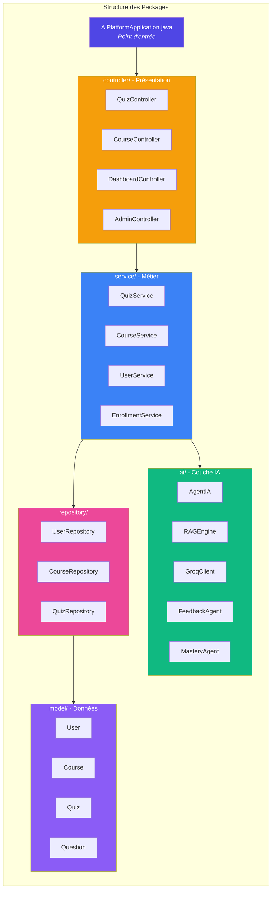
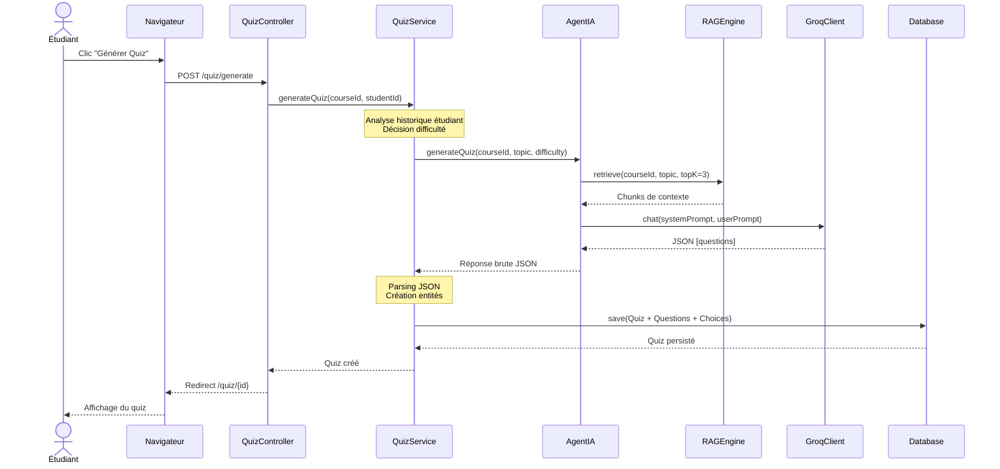
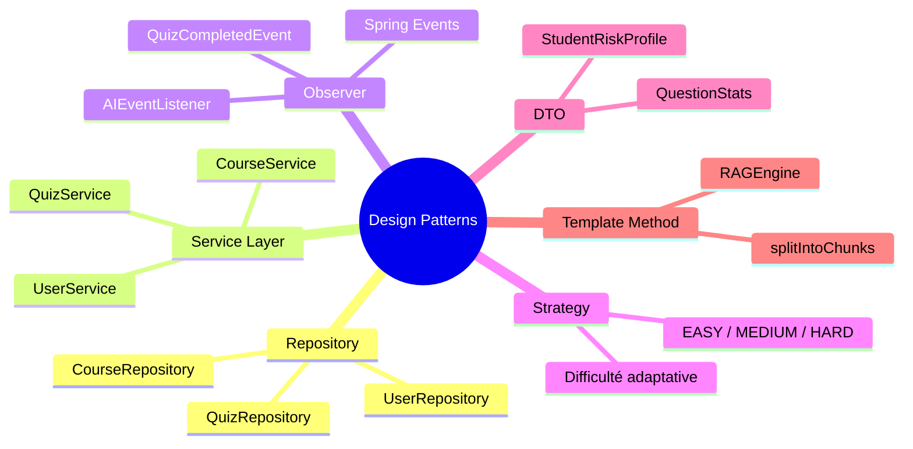
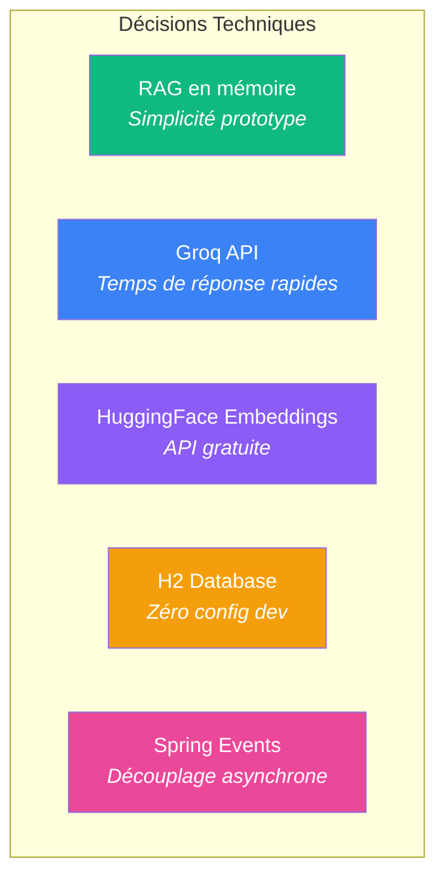

# Analyse du Code Source — Plateforme Éducative IA

**Document technique destiné à l'enseignant**  
Ce document analyse la structure interne et le fonctionnement du code Java de la plateforme éducative.

---

## Table des Matières

1. [Organisation du Code](#1-organisation-du-code)
2. [Point d'Entrée et Flux Global](#2-point-dentrée-et-flux-global)
3. [Analyse des Classes Principales](#3-analyse-des-classes-principales)
4. [Logique Métier et Traitements](#4-logique-métier-et-traitements)
5. [Bonnes Pratiques et Conception](#5-bonnes-pratiques-et-conception)
6. [Points Techniques Notables](#6-points-techniques-notables)

---

## 1. Organisation du Code

### 1.1 Vue d'Ensemble de l'Architecture



### 1.2 Arborescence des Packages

```
src/main/java/com/example/platform/
├── AiPlatformApplication.java     ← Point d'entrée Spring Boot
├── ai/                            ← Couche Intelligence Artificielle (5 classes)
├── config/                        ← Configuration Spring & Sécurité (4 classes)
├── controller/                    ← Contrôleurs MVC (10 classes)
├── dto/                           ← Objets de transfert de données (2 classes)
├── event/                         ← Événements applicatifs (2 classes)
├── listener/                      ← Gestionnaires d'événements (1 classe)
├── model/                         ← Entités JPA (17 classes)
├── repository/                    ← Interfaces Spring Data JPA (13 interfaces)
└── service/                       ← Logique métier (15 classes)
```

### 1.3 Rôle de Chaque Package

| Package | Responsabilité | Nombre de Classes |
|:--------|:---------------|:-----------------:|
| **ai/** | Orchestration IA : génération de quiz, RAG, appels LLM | 5 |
| **config/** | Configuration Spring Security, initialisation BDD | 4 |
| **controller/** | Gestion des requêtes HTTP, routage, vues Thymeleaf | 10 |
| **dto/** | Structures de données pour transferts inter-couches | 2 |
| **event/** | Définition des événements métier | 2 |
| **listener/** | Traitement asynchrone des événements | 1 |
| **model/** | Entités persistantes (User, Course, Quiz, etc.) | 17 |
| **repository/** | Accès aux données (CRUD automatique) | 13 |
| **service/** | Règles métier, validation, orchestration | 15 |

### 1.4 Architecture en Couches


**Principe clé** : Chaque couche ne dépend que de la couche inférieure. Les contrôleurs injectent des services, les services injectent des repositories.

---

## 2. Point d'Entrée et Flux Global

### 2.1 Classe de Démarrage

```java
// AiPlatformApplication.java
@SpringBootApplication
public class AiPlatformApplication {
    public static void main(String[] args) {
        SpringApplication.run(AiPlatformApplication.class, args);
    }
}
```

L'annotation `@SpringBootApplication` combine :
- `@Configuration` — Classe de configuration Spring
- `@EnableAutoConfiguration` — Configuration automatique selon les dépendances
- `@ComponentScan` — Détection automatique des beans dans le package

### 2.2 Séquence d'Initialisation


### 2.3 Flux de Génération d'un Quiz



---

## 3. Analyse des Classes Principales

### 3.1 Couche IA — Diagramme de Classes


### 3.2 AgentIA.java — Orchestrateur Principal

| Aspect | Description |
|--------|-------------|
| **Responsabilité** | Coordonner la génération de contenu IA (quiz, flashcards, roadmaps) |
| **Dépendances** | `GroqClient`, `RAGEngine` |
| **Méthodes clés** | `generateQuiz()`, `generateFlashcards()`, `generateRoadmap()`, `evaluateAnswer()` |

```java
public String generateQuiz(Long courseId, String topic, String difficulty, int numberOfQuestions) {
    // Étape 1 : Récupère le contexte via RAG
    List<String> contextChunks = ragEngine.retrieve(courseId, topic, 3);
    
    // Étape 2 : Construit le prompt système + utilisateur
    String systemPrompt = "You are an expert educational AI...";
    
    // Étape 3 : Appelle le LLM
    return groqClient.chat(systemPrompt, userPrompt);
}
```

**Point technique** : L'agent utilise des prompts structurés avec instructions strictes pour garantir un format JSON parsable.

---

### 3.3 RAGEngine.java — Moteur de Recherche Sémantique


| Aspect | Description |
|--------|-------------|
| **Stockage** | `Map<Long, List<VectorChunk>>` — En mémoire par cours |
| **Chunking** | Paragraphes de ~500 caractères |
| **Embeddings** | 384 dimensions (MiniLM via HuggingFace) |
| **Similarité** | Cosinus entre vecteurs |

```java
// Structure interne
private static class VectorChunk {
    String text;           // Texte original
    List<Double> embedding; // Vecteur 384 dimensions
}

// Calcul de similarité
private double cosineSimilarity(List<Double> v1, List<Double> v2) {
    double dotProduct = 0.0, normA = 0.0, normB = 0.0;
    for (int i = 0; i < v1.size(); i++) {
        dotProduct += v1.get(i) * v2.get(i);
        normA += Math.pow(v1.get(i), 2);
        normB += Math.pow(v2.get(i), 2);
    }
    return dotProduct / (Math.sqrt(normA) * Math.sqrt(normB));
}
```

---

### 3.4 GroqClient.java — Client API LLM

| Aspect | Description |
|--------|-------------|
| **LLM** | API Groq (llama-3.3-70b-versatile) |
| **Embeddings** | API HuggingFace (all-MiniLM-L6-v2) |
| **Configuration** | Injection `@Value` depuis `application.properties` |

```java
private final RestClient groqRestClient;  // Pour le LLM
private final RestClient hfRestClient;    // Pour les embeddings
```

---

### 3.5 Couche Services — QuizService.java


**Logique de difficulté adaptative** :
```java
double averageScore = pastQuizzes.stream()
    .filter(q -> q.getScore() != null)
    .mapToDouble(Quiz::getScore)
    .average().orElse(-1.0);

if (averageScore >= 80.0) {
    difficulty = "HARD";      // Étudiant performant → Challenge
} else if (averageScore < 50.0) {
    difficulty = "EASY";      // Difficultés → Remédiation
}
```

---

### 3.6 Couche Modèle — Relations entre Entités


---

## 4. Logique Métier et Traitements

### 4.1 Localisation de la Logique Principale

| Traitement | Localisation |
|------------|--------------|
| Génération de quiz | `QuizService` → `AgentIA` → `RAGEngine` → `GroqClient` |
| Calcul des scores | `QuizService.submitQuiz()` |
| Validation des inscriptions | `EnrollmentService.validateEnrollment()` |
| Feedback IA post-quiz | `FeedbackAgent` (asynchrone) |
| Suivi de progression | `MasteryService` |

### 4.2 Circulation des Données


### 4.3 Système d'Événements Asynchrones


```java
// Publication (QuizService)
eventPublisher.publishEvent(new QuizCompletedEvent(this, quiz));

// Écoute asynchrone (AIEventListener)
@Async
@EventListener
public void handleQuizCompleted(QuizCompletedEvent event) {
    feedbackAgent.generateFeedback(event);    // Génère feedback IA
    masteryAgent.updateStudentModel(event);   // Met à jour la maîtrise
}
```

---

## 5. Bonnes Pratiques et Conception

### 5.1 Injection de Dépendances (Constructor Injection)

```java
@Service
public class QuizService {
    private final QuizRepository quizRepository;  // final = immutable
    private final AgentIA agentIA;
    
    public QuizService(QuizRepository quizRepository, AgentIA agentIA) {
        this.quizRepository = quizRepository;
        this.agentIA = agentIA;
    }
}
```

| Avantage | Description |
|----------|-------------|
| **Immutabilité** | Champs `final` garantissent l'état |
| **Testabilité** | Facile à mocker pour tests unitaires |
| **Explicite** | Dépendances visibles dans le constructeur |

### 5.2 Patrons de Conception Identifiés



### 5.3 Séparation des Responsabilités (SRP)

| Classe | Responsabilité Unique |
|--------|-----------------------|
| `GroqClient` | Communication API externe |
| `RAGEngine` | Recherche vectorielle |
| `AgentIA` | Construction des prompts |
| `QuizService` | Orchestration métier |
| `QuizController` | Gestion HTTP |

---

## 6. Points Techniques Notables

### 6.1 Choix Architecturaux



### 6.2 Parties Critiques du Code

| Point Critique | Localisation | Description |
|----------------|--------------|-------------|
| **Parsing JSON LLM** | `QuizService:81-98` | Extraction robuste avec `indexOf("[")` |
| **Similarité Cosinus** | `RAGEngine:98-108` | Cœur du système RAG |
| **Validation inscription** | `QuizService:186-188` | Score ≥60% → Validation auto |

### 6.3 Limitations et Évolutions Possibles

| Limitation | Impact | Solution |
|------------|--------|----------|
| RAG en mémoire | Perte au redémarrage | Vector store persistant (Chroma) |
| Pas de cache LLM | Appels coûteux | Redis/Caffeine cache |
| Single-thread RAG | Lent gros volumes | Index parallélisé |
| Pas de pagination | Performance BDD | Spring Data Pageable |

### 6.4 Configuration Externalisée

```properties
# application.properties
ai.groq.api-key=${GROQ_API_KEY:valeur_defaut}
ai.groq.model=llama-3.3-70b-versatile
ai.huggingface.embedding-api=https://router.huggingface.co/...
```

**Note de sécurité** : Les clés API sont injectées via variables d'environnement avec valeurs par défaut.

---

## Conclusion Technique

Ce projet illustre une **architecture Spring Boot moderne** combinant :

- Séparation claire des responsabilités (Layered Architecture)
- Intégration LLM via clients REST
- Système RAG simplifié mais fonctionnel
- Programmation événementielle asynchrone
- Injection de dépendances systématique

La structure du code facilite l'**extension** (nouveaux types de questions, autres LLMs) et la **maintenance** grâce aux bonnes pratiques appliquées.
