# 🎓 Analyse du Code Source — Plateforme Éducative IA

> **Document technique destiné à l'enseignant**  
> Ce document analyse la structure interne et le fonctionnement du code Java de la plateforme éducative.

---

## 📋 Table des Matières

1. [Organisation du Code](#1-organisation-du-code)
2. [Point d'Entrée et Flux Global](#2-point-dentrée-et-flux-global)
3. [Analyse des Classes Principales](#3-analyse-des-classes-principales)
4. [Logique Métier et Traitements](#4-logique-métier-et-traitements)
5. [Bonnes Pratiques et Conception](#5-bonnes-pratiques-et-conception)
6. [Points Techniques Notables](#6-points-techniques-notables)

---

## 1. Organisation du Code

### 1.1 Vue d'Ensemble de l'Architecture


### 1.2 Arborescence des Packages

```
src/main/java/com/example/platform/
├── 🚀 AiPlatformApplication.java     ← Point d'entrée Spring Boot
├── 🤖 ai/                            ← Couche Intelligence Artificielle (5 classes)
├── ⚙️ config/                        ← Configuration Spring & Sécurité (4 classes)
├── 🎮 controller/                    ← Contrôleurs MVC (10 classes)
├── 📋 dto/                           ← Objets de transfert de données (2 classes)
├── 📨 event/                         ← Événements applicatifs (2 classes)
├── 👂 listener/                      ← Gestionnaires d'événements (1 classe)
├── 📊 model/                         ← Entités JPA (17 classes)
├── 💾 repository/                    ← Interfaces Spring Data JPA (13 interfaces)
└── ⚡ service/                       ← Logique métier (15 classes)
```

### 1.3 Rôle de Chaque Package

| Package | 📝 Responsabilité | 📊 Classes |
|:--------|:------------------|:----------:|
| **ai/** | Orchestration IA : génération de quiz, RAG, appels LLM | 5 |
| **config/** | Configuration Spring Security, initialisation BDD | 4 |
| **controller/** | Gestion des requêtes HTTP, routage, vues Thymeleaf | 10 |
| **dto/** | Structures de données pour transferts inter-couches | 2 |
| **event/** | Définition des événements métier | 2 |
| **listener/** | Traitement asynchrone des événements | 1 |
| **model/** | Entités persistantes (User, Course, Quiz, etc.) | 17 |
| **repository/** | Accès aux données (CRUD automatique) | 13 |
| **service/** | Règles métier, validation, orchestration | 15 |

### 1.4 Architecture en Couches

```mermaid
graph TB
    subgraph PRESENTATION["🖥️ COUCHE PRÉSENTATION"]
        direction LR
        T1["Thymeleaf Templates"]
        T2["Controllers MVC"]
        T3["REST APIs"]
    end
    
    subgraph METIER["⚙️ COUCHE MÉTIER"]
        direction LR
        M1["Services"]
        M2["Agents IA"]
        M3["Event Listeners"]
    end
    
    subgraph DONNEES["💾 COUCHE DONNÉES"]
        direction LR
        D1["Repositories"]
        D2["Entités JPA"]
        D3["H2/PostgreSQL"]
    end
    
    PRESENTATION --> METIER
    METIER --> DONNEES
    
    style PRESENTATION fill:#f59e0b,color:#000
    style METIER fill:#3b82f6,color:#fff
    style DONNEES fill:#10b981,color:#fff
```



**Principe clé** : Chaque couche ne dépend que de la couche inférieure. Les contrôleurs injectent des services, les services injectent des repositories.

---

## 2. Point d'Entrée et Flux Global

### 2.1 Classe de Démarrage

```java
// AiPlatformApplication.java
@SpringBootApplication
public class AiPlatformApplication {
    public static void main(String[] args) {
        SpringApplication.run(AiPlatformApplication.class, args);
    }
}
```

L'annotation `@SpringBootApplication` combine :
- `@Configuration` — Classe de configuration Spring
- `@EnableAutoConfiguration` — Configuration automatique selon les dépendances
- `@ComponentScan` — Détection automatique des beans dans le package

### 2.2 Séquence d'Initialisation

```mermaid
sequenceDiagram
    participant JVM
    participant Spring as Spring Boot
    participant Context as ApplicationContext
    participant DB as Database
    participant RAG as RAGEngine
    participant Tomcat
    
    JVM->>Spring: main()
    Spring->>Context: Scan @Component, @Service, @Controller
    Context->>Context: Injection des dépendances
    Context->>DB: Initialisation JPA / H2
    Context->>RAG: DatabaseInitializer.onApplicationEvent()
    RAG->>RAG: Indexation des cours existants
    Context->>Tomcat: Démarrage serveur (port 8080)
    Tomcat-->>JVM: ✅ Application Ready
```



### 2.3 Flux de Génération d'un Quiz

```mermaid
sequenceDiagram
    actor Student as 👨‍🎓 Étudiant
    participant Browser as 🌐 Navigateur
    participant QC as QuizController
    participant QS as QuizService
    participant AI as AgentIA
    participant RAG as RAGEngine
    participant LLM as GroqClient
    participant DB as 💾 Database
    
    Student->>Browser: Clic "Générer Quiz"
    Browser->>QC: POST /quiz/generate
    QC->>QS: generateQuiz(courseId, studentId)
    
    Note over QS: 📊 Analyse historique étudiant<br/>→ Décision difficulté
    
    QS->>AI: generateQuiz(courseId, topic, difficulty)
    AI->>RAG: retrieve(courseId, topic, topK=3)
    RAG-->>AI: 📄 Chunks de contexte
    
    AI->>LLM: chat(systemPrompt, userPrompt)
    LLM-->>AI: 📝 JSON [questions]
    
    AI-->>QS: Réponse brute JSON
    
    Note over QS: 🔄 Parsing JSON<br/>→ Création entités
    
    QS->>DB: save(Quiz + Questions + Choices)
    DB-->>QS: Quiz persisté
    
    QS-->>QC: Quiz créé
    QC-->>Browser: Redirect /quiz/{id}
    Browser-->>Student: 📋 Affichage du quiz
```



---

## 3. Analyse des Classes Principales

### 3.1 Couche IA — Diagramme de Classes

```mermaid
classDiagram
    class AgentIA {
        -GroqClient groqClient
        -RAGEngine ragEngine
        +generateQuiz(courseId, topic, difficulty, count) String
        +generateFlashcards(topic, content, count) String
        +generateRoadmap(topic) String
        +evaluateAnswer(question, answer, criteria) String
    }
    
    class RAGEngine {
        -GroqClient groqClient
        -Map~Long, List~VectorChunk~~ vectorStore
        +ingest(courseId, content) void
        +addDocument(courseId, content) void
        +retrieve(courseId, query, topK) List~String~
        -splitIntoChunks(text, maxSize) List~String~
        -cosineSimilarity(v1, v2) double
    }
    
    class GroqClient {
        -RestClient groqRestClient
        -RestClient hfRestClient
        -String model
        +generate(prompt) String
        +chat(systemMessage, userMessage) String
        +embed(text) List~Double~
    }
    
    class FeedbackAgent {
        -GroqClient groqClient
        -QuizFeedbackRepository feedbackRepository
        +generateFeedback(event) void
    }
    
    class MasteryAgent {
        -MasteryService masteryService
        +updateStudentModel(event) void
    }
    
    AgentIA --> GroqClient : utilise
    AgentIA --> RAGEngine : utilise
    RAGEngine --> GroqClient : embeddings
    FeedbackAgent --> GroqClient : utilise
    MasteryAgent --> MasteryService : délègue
```



### 3.2 AgentIA.java — Orchestrateur Principal

| 📌 Aspect | 📝 Description |
|-----------|----------------|
| **Responsabilité** | Coordonner la génération de contenu IA (quiz, flashcards, roadmaps) |
| **Dépendances** | `GroqClient`, `RAGEngine` |
| **Méthodes clés** | `generateQuiz()`, `generateFlashcards()`, `generateRoadmap()`, `evaluateAnswer()` |

```java
public String generateQuiz(Long courseId, String topic, String difficulty, int numberOfQuestions) {
    // 1️⃣ Récupère le contexte via RAG
    List<String> contextChunks = ragEngine.retrieve(courseId, topic, 3);
    
    // 2️⃣ Construit le prompt système + utilisateur
    String systemPrompt = "You are an expert educational AI...";
    
    // 3️⃣ Appelle le LLM
    return groqClient.chat(systemPrompt, userPrompt);
}
```

> 💡 **Point technique** : L'agent utilise des prompts structurés avec instructions strictes pour garantir un format JSON parsable.

---

### 3.3 RAGEngine.java — Moteur de Recherche Sémantique

```mermaid
flowchart LR
    subgraph INGEST["📥 Indexation"]
        A[Contenu cours] --> B[Chunking 500 chars]
        B --> C[Embedding HuggingFace]
        C --> D[(VectorStore en mémoire)]
    end
    
    subgraph RETRIEVE["🔍 Recherche"]
        E[Query utilisateur] --> F[Embedding query]
        F --> G[Similarité Cosinus]
        G --> H[Top-K résultats]
    end
    
    D --> G
    
    style INGEST fill:#10b981,color:#fff
    style RETRIEVE fill:#3b82f6,color:#fff
```



| 📌 Aspect | 📝 Description |
|-----------|----------------|
| **Stockage** | `Map<Long, List<VectorChunk>>` — En mémoire par cours |
| **Chunking** | Paragraphes de ~500 caractères |
| **Embeddings** | 384 dimensions (MiniLM via HuggingFace) |
| **Similarité** | Cosinus entre vecteurs |

```java
// Structure interne
private static class VectorChunk {
    String text;           // Texte original
    List<Double> embedding; // Vecteur 384 dimensions
}

// Calcul de similarité
private double cosineSimilarity(List<Double> v1, List<Double> v2) {
    double dotProduct = 0.0, normA = 0.0, normB = 0.0;
    for (int i = 0; i < v1.size(); i++) {
        dotProduct += v1.get(i) * v2.get(i);
        normA += Math.pow(v1.get(i), 2);
        normB += Math.pow(v2.get(i), 2);
    }
    return dotProduct / (Math.sqrt(normA) * Math.sqrt(normB));
}
```

---

### 3.4 GroqClient.java — Client API LLM

| 📌 Aspect | 📝 Description |
|-----------|----------------|
| **LLM** | API Groq (llama-3.3-70b-versatile) |
| **Embeddings** | API HuggingFace (all-MiniLM-L6-v2) |
| **Configuration** | Injection `@Value` depuis `application.properties` |

```java
private final RestClient groqRestClient;  // 🤖 Pour le LLM
private final RestClient hfRestClient;    // 🔢 Pour les embeddings
```

---

### 3.5 Couche Services — QuizService.java

```mermaid
flowchart TB
    subgraph GENERATE["generateQuiz()"]
        A[Récupérer historique étudiant] --> B{Score moyen?}
        B -->|≥80%| C[HARD]
        B -->|<50%| D[EASY]
        B -->|50-80%| E[MEDIUM]
        C --> F[Appeler AgentIA]
        D --> F
        E --> F
        F --> G[Parser JSON]
        G --> H[Créer entités]
        H --> I[Sauvegarder en BDD]
    end
    
    subgraph SUBMIT["submitQuiz()"]
        J[Calculer score] --> K{Score ≥60%?}
        K -->|Oui| L[Valider inscription]
        K -->|Non| M[Pas de validation]
        L --> N[Publier QuizCompletedEvent]
        M --> N
        N --> O[Vérifier badges]
    end
    
    style GENERATE fill:#4f46e5,color:#fff
    style SUBMIT fill:#10b981,color:#fff
```



**Logique de difficulté adaptative** :
```java
double averageScore = pastQuizzes.stream()
    .filter(q -> q.getScore() != null)
    .mapToDouble(Quiz::getScore)
    .average().orElse(-1.0);

if (averageScore >= 80.0) {
    difficulty = "HARD";      // 🎯 Étudiant performant → Challenge
} else if (averageScore < 50.0) {
    difficulty = "EASY";      // 📚 Difficultés → Remédiation
}
```

---

### 3.6 Couche Modèle — Relations entre Entités

```mermaid
erDiagram
    USER ||--o{ ENROLLMENT : "inscrit à"
    USER ||--o{ QUIZ : "passe"
    USER ||--o{ STUDENT_MASTERY : "a"
    USER ||--o{ USER_ACHIEVEMENT : "gagne"
    USER ||--o{ NOTIFICATION : "reçoit"
    
    COURSE ||--o{ ENROLLMENT : "contient"
    COURSE ||--o{ QUIZ : "génère"
    COURSE ||--o{ FLASHCARD : "a"
    COURSE ||--o{ RESOURCE : "contient"
    COURSE ||--o{ DISCUSSION : "a"
    COURSE }o--|| USER : "créé par (teacher)"
    
    QUIZ ||--o{ QUESTION : "contient"
    QUIZ ||--o| QUIZ_FEEDBACK : "a"
    
    QUESTION ||--o{ CHOICE : "a"
    
    DISCUSSION ||--o{ COMMENT : "contient"
    
    USER {
        Long id PK
        String username
        String password
        Role role
        String email
    }
    
    COURSE {
        Long id PK
        String title
        String content
        boolean published
        Long teacher_id FK
    }
    
    QUIZ {
        Long id PK
        Long course_id FK
        Long user_id FK
        String level
        Double score
    }
    
    QUESTION {
        Long id PK
        Long quiz_id FK
        String statement
        QuestionType type
    }
```



---

## 4. Logique Métier et Traitements

### 4.1 Localisation de la Logique Principale

| 🔄 Traitement | 📍 Localisation |
|---------------|-----------------|
| Génération de quiz | `QuizService` → `AgentIA` → `RAGEngine` → `GroqClient` |
| Calcul des scores | `QuizService.submitQuiz()` |
| Validation des inscriptions | `EnrollmentService.validateEnrollment()` |
| Feedback IA post-quiz | `FeedbackAgent` (asynchrone) |
| Suivi de progression | `MasteryService` |

### 4.2 Circulation des Données

```mermaid
flowchart LR
    subgraph EXTERNE["☁️ APIs Externes"]
        GROQ["Groq API<br/>LLM"]
        HF["HuggingFace<br/>Embeddings"]
    end
    
    subgraph IA["🤖 Couche IA"]
        CLIENT["GroqClient"]
        RAG["RAGEngine"]
        AGENT["AgentIA"]
    end
    
    subgraph METIER["⚙️ Couche Métier"]
        QS["QuizService"]
        CS["CourseService"]
    end
    
    subgraph DATA["💾 Couche Données"]
        REPO["Repositories"]
        DB[(Database)]
    end
    
    GROQ <-->|JSON| CLIENT
    HF <-->|Vectors| CLIENT
    CLIENT --> AGENT
    CLIENT --> RAG
    RAG --> AGENT
    AGENT --> QS
    CS --> RAG
    QS --> REPO
    CS --> REPO
    REPO --> DB
```



### 4.3 Système d'Événements Asynchrones


```java
// Publication (QuizService)
eventPublisher.publishEvent(new QuizCompletedEvent(this, quiz));

// Écoute asynchrone (AIEventListener)
@Async
@EventListener
public void handleQuizCompleted(QuizCompletedEvent event) {
    feedbackAgent.generateFeedback(event);    // 💬 Génère feedback IA
    masteryAgent.updateStudentModel(event);   // 📈 Met à jour la maîtrise
}
```

---

## 5. Bonnes Pratiques et Conception

### 5.1 Injection de Dépendances (Constructor Injection)

```java
@Service
public class QuizService {
    private final QuizRepository quizRepository;  // ✅ final = immutable
    private final AgentIA agentIA;
    
    public QuizService(QuizRepository quizRepository, AgentIA agentIA) {
        this.quizRepository = quizRepository;
        this.agentIA = agentIA;
    }
}
```

| ✅ Avantage | 📝 Description |
|-------------|----------------|
| **Immutabilité** | Champs `final` garantissent l'état |
| **Testabilité** | Facile à mocker pour tests unitaires |
| **Explicite** | Dépendances visibles dans le constructeur |

### 5.2 Patrons de Conception Identifiés

```mermaid
mindmap
  root((🏗️ Design Patterns))
    Repository
      CourseRepository
      UserRepository
      QuizRepository
    Service Layer
      QuizService
      CourseService
      UserService
    Observer
      Spring Events
      QuizCompletedEvent
      AIEventListener
    Strategy
      Difficulté adaptative
      EASY / MEDIUM / HARD
    DTO
      QuestionStats
      StudentRiskProfile
    Template Method
      splitIntoChunks
      RAGEngine
```



### 5.3 Séparation des Responsabilités (SRP)

| 🏷️ Classe | 🎯 Responsabilité Unique |
|-----------|--------------------------|
| `GroqClient` | Communication API externe |
| `RAGEngine` | Recherche vectorielle |
| `AgentIA` | Construction des prompts |
| `QuizService` | Orchestration métier |
| `QuizController` | Gestion HTTP |

---

## 6. Points Techniques Notables

### 6.1 Choix Architecturaux

```mermaid
graph TB
    subgraph CHOIX["🎯 Décisions Techniques"]
        A["RAG en mémoire<br/><i>Simplicité prototype</i>"]
        B["Groq API<br/><i>Temps de réponse rapides</i>"]
        C["HuggingFace Embeddings<br/><i>API gratuite</i>"]
        D["H2 Database<br/><i>Zéro config dev</i>"]
        E["Spring Events<br/><i>Découplage asynchrone</i>"]
    end
    
    style A fill:#10b981,color:#fff
    style B fill:#3b82f6,color:#fff
    style C fill:#8b5cf6,color:#fff
    style D fill:#f59e0b,color:#fff
    style E fill:#ec4899,color:#fff
```



### 6.2 Parties Critiques du Code

| 🔴 Point Critique | 📍 Localisation | 📝 Description |
|-------------------|-----------------|----------------|
| **Parsing JSON LLM** | `QuizService:81-98` | Extraction robuste avec `indexOf("[")` |
| **Similarité Cosinus** | `RAGEngine:98-108` | Cœur du système RAG |
| **Validation inscription** | `QuizService:186-188` | Score ≥60% → Validation auto |

### 6.3 Limitations et Évolutions Possibles

| ⚠️ Limitation | 💥 Impact | 💡 Solution |
|---------------|-----------|-------------|
| RAG en mémoire | Perte au redémarrage | Vector store persistant (Chroma) |
| Pas de cache LLM | Appels coûteux | Redis/Caffeine cache |
| Single-thread RAG | Lent gros volumes | Index parallélisé |
| Pas de pagination | Performance BDD | Spring Data Pageable |

### 6.4 Configuration Externalisée

```properties
# application.properties
ai.groq.api-key=${GROQ_API_KEY:valeur_defaut}
ai.groq.model=llama-3.3-70b-versatile
ai.huggingface.embedding-api=https://router.huggingface.co/...
```

> 🔐 Les clés API sont injectées via variables d'environnement avec valeurs par défaut.

---

## 🎓 Conclusion Technique

Ce projet illustre une **architecture Spring Boot moderne** combinant :

- ✅ Séparation claire des responsabilités (Layered Architecture)
- ✅ Intégration LLM via clients REST
- ✅ Système RAG simplifié mais fonctionnel
- ✅ Programmation événementielle asynchrone
- ✅ Injection de dépendances systématique

La structure du code facilite l'**extension** (nouveaux types de questions, autres LLMs) et la **maintenance** grâce aux bonnes pratiques appliquées.
